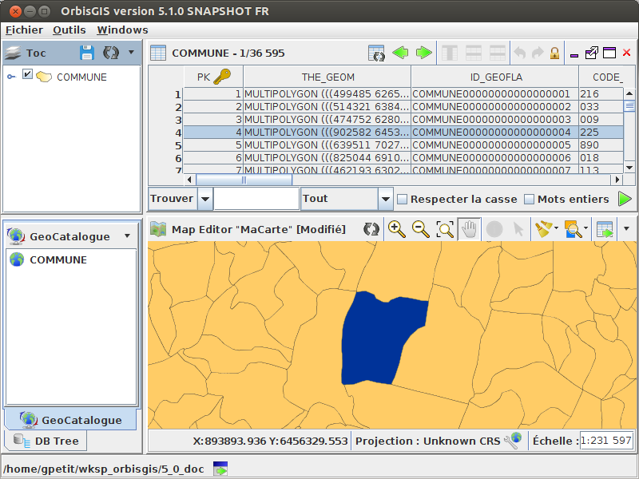

Show attributes 
========

To show the layer’s attributes, select it in the TOC (or in Geocatalog) and make a right-click --> "Open attributes" ( |OpenAttributes| ).

A new tab appears in the UI with all the attributes.

**Remarks**

- On the top, the table name is displayed (in the illustration below "COMMUNE") with the number of (selected) objects,
- There is a dynamic link between a row in the table and the object displayed in the map. So, if you select a row in the table and make a right-click, you can zoom on the selection using the “Zoom to selection” tool ( |ZoomToSelection| ),
- Primary key is identified with a specific icon ( |PK| ),
- Numeric fields are aligned on the right. Other types of field *(string, boolean, ...)* are aligned on the left.

.. |OpenAttributes| image:: ../_images/table.png
              :alt: Open attributes icon

.. |PK| image:: ../_images/key.png
              :alt: Primary key icon

Operation on lines
---------------

With a right-click on a line, the user can access to several options:

- Filter selected rows ( |FilterSelection| ) (non-selected lines will be hidden),
- Create a datasource from the selection ( |CreateDataFromSel| ): export the selection into a new layer,
- Unselect ( |Unselect| ),
- Zoom to selection ( |ZoomToSelection| ),
- Reverse the selection ( |ReverseSelection| ),
- Select rows with the same value: search all the lines that has the same value in the selected field ( |SelectSameRows| ).

.. |ZoomToSelection| image:: ../_images/zoom_selected.png
              :alt: Zoom to selection tool

.. |FilterSelection| image:: ../_images/row_filter.png
              :alt: Filter selection icon

.. |CreateDataFromSel| image:: ../_images/table_go.png
              :alt: Create Datasource from selection icon

.. |Unselect| image:: ../_images/edit-clear.png
              :alt: Unselection icon

.. |ReverseSelection| image:: ../_images/reverse_selection.png
              :alt: Reverse selection icon

Operation on a field
---------------

With a right-click on a field, the user can access to several options:

- Sort ascending ( |Asc| ) / descending ( |Desc| ),
- Unsort ( |Unsort| ),
- Show column information ( |Info| ),
- Show statistics (only for numeric fields) ( |Statistics| ).

.. |SelectSameRows| image:: ../_images/selectsame_row.png
              :alt: Selection same rows icon

.. |Unsort| image:: ../_images/table_refresh.png
              :alt: Unsort icon

.. |Info| image:: ../_images/information.png
              :alt: Information icon

.. |Statistics| image:: ../_images/statistics.png
              :alt: Statistics icon

Search engine
---------------

In the lower part of the window, there is a search engine that can be used in two ways:

- "Find" mode: enter a value, optionnaly choose a field and specify options,
- "SQL" mode: just write an SQL instruction and press the "Execute" ( |SQLExecute| ) icon.

.. |SQLExecute| image:: ../_images/execute.png
              :alt: Execute SQL instruction icon

