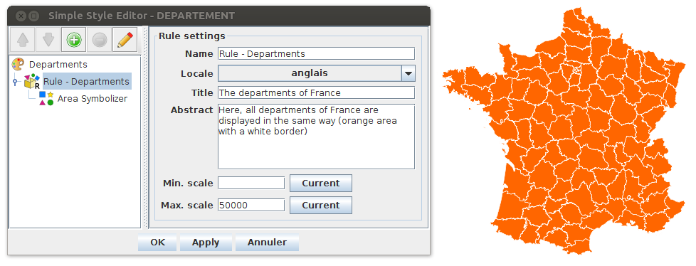
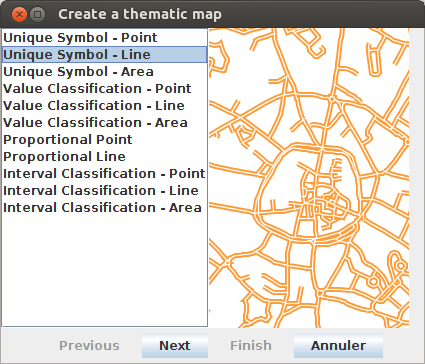
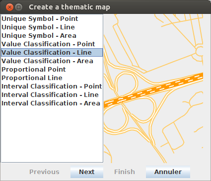
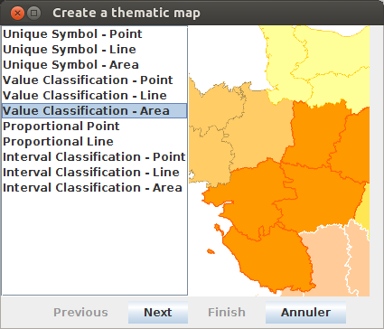
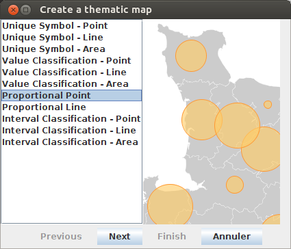
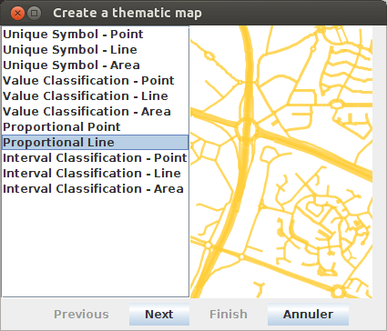

.. Author : Gwendall PETIT (Lab-STICC - CNRS UMR 6285 / DECIDE Team)

.. _cartography:

Cartography 
===========

OrbisGIS offers methods to produce maps using a cartographic language, which is managed in a style model. The style model is based on a research work that propose to extend the OGC `Symbology Encoding`_ standard. If you want to know more about this standard, have a look at this `website`_.

.. _Symbology Encoding: http://www.opengeospatial.org/standards/se

.. _website: http://se.orbisgis.org/

Symbology Encoding
-------------------------------------------

In this standard, a style is defined with a set of elements:

* Style: a style is composed of one or *n* rule(s)
	* Rule: a rule has one or *n* symbolizer(s)
		* Symbolizer: a way to render geometries

A style can be configured with:

* a name,
* a local langage (you can configure different languages in the same style),
* a title *(one per langage)*,
* an abstract *(one per langage)*.

A rule can be configured with:

* a name,
* a local langage (you can configure different languages in the same style),
* a title *(one per langage)*,
* an abstract *(one per langage)*,
* Min and/or Max scale of visibility.

A symbolizer can be:

* a point,
* a line,
* a polygon.

Here, we propose a pre-configured set of symbolizers to create maps:

* `Unique symbol`_, 
* `Value classification`_, 
* `Proportionnal symbol`_, 
* `Interval classification`_.

Below is an example with a `Unique symbol`_ representation for the french departments. On the left side of the UI, we can see the three levels of the style (Style / Rule / Symbolizer). On the right side of the UI, we have the "rule settings" panel.

In OrbisGIS, styles can be exported (or imported)  as an .se file, encoded in xml.

Manage styles
-------------------------------------------

In the TOC ( |TOC| ) you have options to manage the style of your layer. Through a right-click on the layer, you can:

* Import a style ( |ImportStyle| ),
* Create a thematic analysis ( |Thematic| ): see below the list of available analysis (`Unique symbol`_, `Value classification`_, `Proportionnal symbol`_, `Interval classification`_),
* Edit ( |EditStyle| ), delete ( |RemoveStyle| ) or export ( |ExportStyle| ) an existing style,

.. |TOC| image:: ../_images/toc.png
              :alt: TOC icon
	      :width: 16 pt

.. |ImportStyle| image:: ../_images/palette_import.png
              :alt: Import a style icon
	      :width: 16 pt

.. |Thematic| image:: ../_images/palette_add.png
              :alt: Create a thematic analysis icon
	      :width: 16 pt

.. |ExportStyle| image:: ../_images/palette_export.png
              :alt: Export a style icon
	      :width: 16 pt

.. |EditStyle| image:: ../_images/palette_edit.png
              :alt: Edit a style icon
	      :width: 16 pt

.. |RemoveStyle| image:: ../_images/palette_remove.png
              :alt: Remove a style icon
	      :width: 16 pt

You can also unfold *(see red circle in the illustration below)* a layer to display all the different styles that are associated (between 1 and *n*).

.. image:: ../_images/thematic_many_styles.png
              :alt: One or n styles
              :align: center

*Remark : Each style can be (un)checked to be (un)visible.*

By default, when loading the layer into the TOC, a `Unique symbol`_ style is applied. In the example below, two styles are associated to the DEPARTEMENT layer : one default and one `Value classification`_ *(in the foreground)*.

.. image:: ../_images/thematic_unfold_styles.png
              :alt: Unfold styles
              :align: center

Unique symbol
-------------------------------------------

In the layer, each objects have the same symbology (same border, fill, opacity, ...). Unique symbol works with point, line or area geometries.

Depending on the geometry dimension, the user can manage:

* Fill settings: enable or not, color, opacity,
* Border settings: enable or not, color, width unit, width, opacity, dash array, 
* Symbol settings (only for point): place (vertex or interior), shape (circle, half-circle, square, triangle, star, ...), size (width & height), size unit.

Unique symbol - Point
**********************************

.. image:: ../_images/thematic_us_point.png
              :alt: Unique symbol - Point
              :align: center

Unique symbol - Line
**********************************

Unique symbol - Area
**********************************

.. image:: ../_images/thematic_us_area.png
              :alt: Unique symbol - Area
              :align: center

Value classification
-------------------------------------------

For one specific field, every objects that have the same value, have the same symbology. This classification is available for point, line or area geometries.

* The field used to make the classification can be numeric, text, boolean, ...
* For each classes, the user can configure the corresponding symbology (fill, border, ... see `Unique symbol`_)

Value classification - Point
**********************************

.. image:: ../_images/thematic_class_point.png
              :alt: Value classification - Point
              :align: center

Value classification - Line
**********************************

Value classification - Area
**********************************

Proportionnal symbol
-------------------------------------------

The size of an object depends one the value presents in a specific numeric field. This classification is available for point or line symbolizers.

The user can manage:

* The field. Only numeric fields can be selected,
* The symbol: Shape, color, ... , size (min & max) and place (only for point)

Proportionnal Point
**********************************

Proportionnal Line
**********************************

Interval classification
-------------------------------------------

A numeric field is used to make a classification by intervals. The user is able to:

* manage the statistical method used to classify : Manual, Quantiles, Equal intervals, Mean - Standard deviation, Nested Averages, Jenks method,
* manage the desired number of classes,
* manage the color schema: choice between a gradient (from color x to color z) or a pallet,
* enable or not the fallback symbol,
* modify manually classes (thresholds, symbology, labels, add/remove classes).

Interval Classification - Point
**********************************

.. image:: ../_images/thematic_inter_point.png
              :alt: Interval Classification - Point
              :align: center

Interval Classification - Line
**********************************

.. image:: ../_images/thematic_inter_line.png
              :alt: Interval Classification - Line
              :align: center

Interval Classification - Area
**********************************

.. image:: ../_images/thematic_inter_area.png
              :alt: Interval Classification - Area
              :align: center

Complex styles
-------------------------------------------

Thanks to the UI, the user is able to built "complex" styles, made with various rules and symbolizers.

In the example below, for one layer (DEPARTEMENT), we have one style composed of 3 rules in which there is different symbolizers:

* Rule 1:
       * Unique symbol - Point
       * Unique symbol - Area
* Rule 2:
       * Unique symbol - Point
       * Value classification - Area
       * Proportional point
* Rule 3:
       * Unique symbol - Line
       * Interval classification - Area

.. image:: ../_images/thematic_complex_style.png
              :alt: Complex styles
              :align: center

Using the toolbar, the user can:

* Move up ( |ToolUp| ) the symbolizer / rule,
* Move down ( |ToolDown| ) the symbolizer / rule,
* Add ( |ToolAdd| ) a symbolizer / rule,
* Remove ( |ToolRemove| ) the selected symbolizer / rule,
* Edit ( |ToolEdit| ) the selected symbolizer / rule,

.. |ToolAdd| image:: ../_images/thematic_tool_add.png
              :alt: Add icon
              :width: 16 pt

.. |ToolRemove| image:: ../_images/thematic_tool_remove.png
              :alt: Remove icon
              :width: 16 pt

.. |ToolEdit| image:: ../_images/thematic_tool_edit.png
              :alt: Edit icon
              :width: 16 pt

.. |ToolUp| image:: ../_images/thematic_tool_up.png
              :alt: Up icon
              :width: 16 pt

.. |ToolDown| image:: ../_images/thematic_tool_down.png
              :alt: Down icon
              :width: 16 pt

