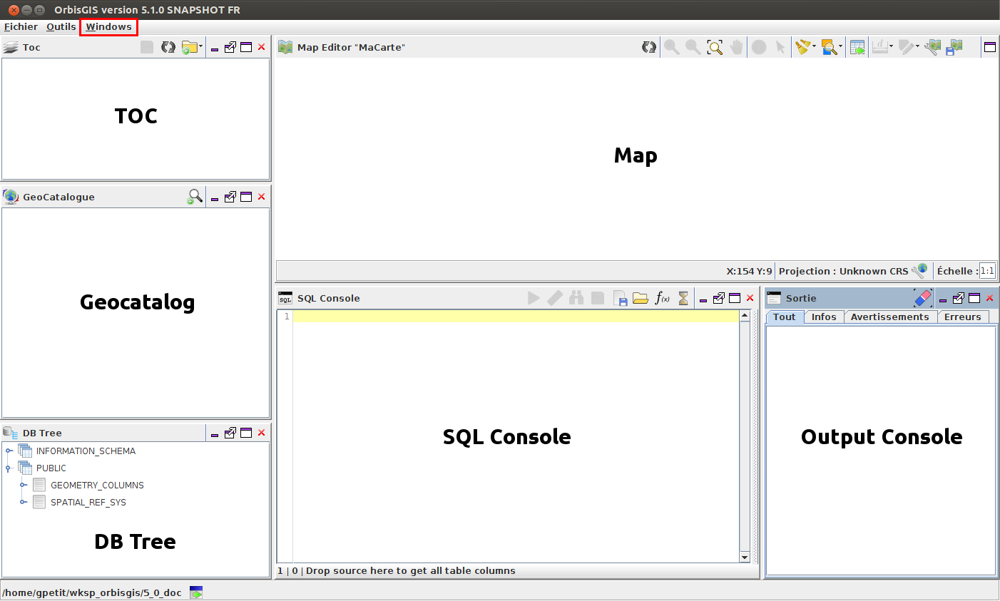

Main Components 
========

Here is a list of the main components of OrbisGIS. Except for the map, these components can be: 

- made visible or not *(just close the component to hide it)*,
- resized *(using the cursor of your mouse)*, 
- moved *(drag & drop the component to a new place in the UI)*,
- (un)docked *(pretty useful if you have a dual screen)*.

To load a component, check the list in the "Windows" menu *(in red in the illustration above)*.

Geocatalog
---------------

The Geocatalog ( |GeoCatalog| ) is the place where datasources are managed. Through a right-click in the blank area, the user can:

- Add a datasource (a file |AddFile| or a folder |AddFolder| ),
- Import a datasource (a file or a folder),
- Export layers into flat files or databases ( |Export| ),
- Show the attributes tables ( |OpenAttributes| ),
- Remove a datasource ( |Remove| ),
- Clear the Geocatalog : all the sources are removed from OrbisGIS,
- Refresh the list ( |Refresh| ).

.. |GeoCatalog| image:: ../_images/geocatalog.png
              :alt: Geocatalog icon
	      :width: 16 pt

.. |AddFile| image:: ../_images/page_white_add.png
              :alt: Add a file icon
	      :width: 16 pt

.. |AddFolder| image:: ../_images/folder_add.png
              :alt: Add a file icon
	      :width: 16 pt

.. |Export| image:: ../_images/page_white_save.png
              :alt: Export a file icon
	      :width: 16 pt

.. |OpenAttributes| image:: ../_images/table.png
              :alt: Open attributes icon
	      :width: 16 pt

.. |Remove| image:: ../_images/remove.png
              :alt: Remove icon
	      :width: 16 pt

.. |Refresh| image:: ../_images/refresh.png
              :alt: Refresh icon
	      :width: 16 pt

Map
---------------

The map ( |Map| ) is the place where geographic informations (vector or raster) are displayed. The user can navigate into the map (using zoom or pan tools), select and get informations on objects.

.. |Map| image:: ../_images/map.png
              :alt: Map icon
	      :width: 16 pt

TOC
---------------

TOC ( |TOC| ) stands for "Table Of Content". This component allows the user to:

- Make visible or not the layer with the checkbox (on the left),
- Change the layer name --> make a double-click on the layer. Then change the name and press “Entrer”,
- Change the order of layers --> drag & drop the layer upward or downward,
- Add WMS layers ( |AddWMS| ),
- Add a layer group ( |AddFolder| ).

Moreover, several features are available via a right-click:

- Show attributes ( |OpenAttributes| ): show the attributes's table,
- Zoom to the layer ( |ZoomLayer| ): Extended zoom on the layer,
- Import a style ( |ImportStyle| ),
- Create a thematic analysis ( |Thematic| ),
- Edit ( |EditStyle| ), delete ( |RemoveStyle| ) or export ( |ExportStyle| ) an existing style,
- Remove the layer ( |Remove| ): Remove the layer from the TOC,
- Start edition ( |Edit| ): To edit a layer *(e.g: add a field, delete an object, …)*.

.. |TOC| image:: ../_images/toc.png
              :alt: TOC icon
	      :width: 16 pt

.. |AddWMS| image:: ../_images/world_add.png
              :alt: Add a WMS icon
	      :width: 16 pt

.. |ZoomLayer| image:: ../_images/zoom_layer.png
              :alt: Zoom to layer icon
	      :width: 16 pt

.. |ImportStyle| image:: ../_images/palette_import.png
              :alt: Import a style icon
	      :width: 16 pt

.. |Thematic| image:: ../_images/palette_add.png
              :alt: Create a thematic analysis icon
	      :width: 16 pt

.. |ExportStyle| image:: ../_images/palette_export.png
              :alt: Export a style icon
	      :width: 16 pt

.. |EditStyle| image:: ../_images/palette_edit.png
              :alt: Edit a style icon
	      :width: 16 pt

.. |RemoveStyle| image:: ../_images/palette_remove.png
              :alt: Remove a style icon
	      :width: 16 pt

.. |Edit| image:: ../_images/pencil.png
              :alt: Edit icon
	      :width: 16 pt

DB Tree
---------------

The DB Tree ( |DBTree| ) is a tree representation of all the layers loaded in OrbisGIS. Layers *(tables)* are listed into their respectives folder *(views)*.
Specific options allows the user to:

- Create spatial index (|GeoIndex| ),
- Create alphanumeric index ( |AlphaIndex| ),
- Remove columns ( |Remove| ).

.. |DBTree| image:: ../_images/db_tree.png
              :alt: DB Tree icon
	      :width: 16 pt

.. |GeoIndex| image:: ../_images/index_geo.png
              :alt: Geographic index icon
	      :width: 16 pt

.. |AlphaIndex| image:: ../_images/index_alpha.png
              :alt: Alphanumeric index icon
	      :width: 16 pt

Output console
---------------

The output ( |Output| ) console is the place where all messages (informations, warnings or errors) are displayed.

.. |Output| image:: ../_images/output.png
              :alt: Output icon
	      :width: 16 pt

SQL console
---------------

The SQL console ( |SQLConsole| ) is the place where the user can execute SQL scripts. This component can be considered as a text editor. The user is able to:

- Write & execute ( |SQLExecute| ) instructions,
- Load & Save .sql files,
- Search (spatial) SQL functions and operators into a predetermined list ( |SQLfunctions| ),
- Search & Replace words *(with advanced options)* ( |Search| ),
- Share SQL instructions via email *(need a specific plugin)*,
- To auto-complete instructions *(see more below)*.

**Auto-completion**

To use the auto-completion, just press "Ctrl + Space". For example, if you write “sel” and then press “Ctrl + Space”, OrbisGIS will recognize that you want to write “SELECT”. In the same spirit, if you start writing the name of a function, a table or field, a dropdown list will appear on the right to offer you the corresponding elements.

See an illustration video_.

.. _video: https://www.youtube.com/watch?v=neFpyo2qaAI

N.B: This component is available through the "Tools" menu.

.. |SQLConsole| image:: ../_images/sql_code.png
              :alt: SQL Console icon
	      :width: 16 pt

.. |SQLExecute| image:: ../_images/execute.png
              :alt: Execute SQL instruction icon
	      :width: 16 pt

.. |SQLfunctions| image:: ../_images/builtinfunctionmap.png
              :alt: SQL functions icon
	      :width: 16 pt

.. |Search| image:: ../_images/find.png
              :alt: Search icon
	      :width: 16 pt
