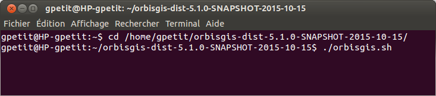

Installation
=======

Requierement
-------------------

Before using OrbisGIS, you must ensure that you are running at least the **JAVA 7** virtual machine (openJDK_ or Oracle_).

.. _OpenJDK: http://openjdk.java.net/
.. _Oracle: http://www.java.com/en/

Download
--------------

To download OrbisGIS, just consult the official website here_.

.. _here: http://www.orbisgis.org/index.html#download

Execute
------------

OrbisGIS is a standalone application. It means that, if you want (see `Ubuntu PPA repository`_), no installation is needed. In addition, it also means that you can play with OrbisGIS without any "administrator" rule !

Once the orbisgis-bin.zip file downloaded, just unzip the file.

.. image:: ../_images/install_zip.png
              :alt: Zip folder
              :align: center

In this folder, you can just focus on:

- orbisgis.sh : the Linux and iOS launcher,
- orbisgis_safemode.sh : the same, but in "safemode",
- orbigis_windows.bat : the Windows launcher,
- orbigis_windows.bat : ... in "safemode",
- orbisgis.jar : the application itself.

*Note that "Safemode" is only useful when OrbisGIS does not start successfully. Running this file will uninstall all plugins and former OrbisGIS modules.*

To launch OrbisGIS, you have the choice between:

- a double-click on the .jar file,
- for Windows, double-click on the .bat file,
- for Linux and iOS, double-click on the .sh file.

**Remarks**

- "execution rights" are sometimes needed.
- If you want to specify the jvm memory size, please consult this page_ on the OrbisGIS wiki.

.. _page: https://github.com/orbisgis/orbisgis/wiki/Frequently-Asked-Questions#how-to-increase-the-jvm-memory-size-

Run the .sh file
--------------------

To run the .sh file *(in Linux and iOS)* in command line, just follow these two steps:

1. open a terminal *(Ctrl+Alt+T)*, then go in the unzipped folder (using the command cd /your_url)
2. run the file with the following command

.. code-block:: java

	./orbisgis.sh

Note: You must have the rights to run this file. To do this, you can use the following command: 

.. code-block:: java

	chmod ug+x ./orbisgis.sh

... and your file will be executable.

Ubuntu PPA repository
-----------------------------

If you are using Ubuntu (or a Debian like distribution) you also have the possibily to connect to our PPA repository, available here : https://launchpad.net/~orbisgis/+archive/ubuntu/orbisgis-unstable

To add this repository and to install OrbisGIS (snapshot version), just execute the following command lines:

.. code-block:: bash

	sudo add-apt-repository ppa:orbisgis/orbisgis-unstable
	sudo apt-get update
	sudo apt-get install orbisgis

Once done, you can launch OrbisGIS thanks to the shortcut in the "Applications/Education" menu

.. image:: ../_images/og_ubuntu_menu.png
              :alt: OrbisGIS menu in Ubuntu
              :align: center

or enter the following command in the terminal:

.. code-block:: bash

	orbisgis