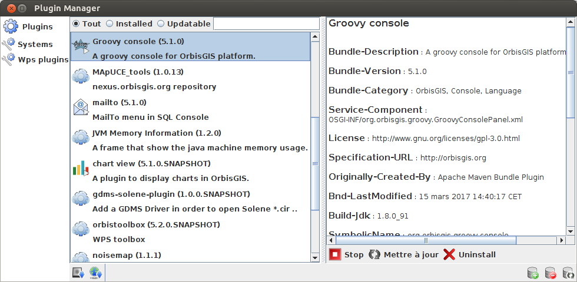

.. Author : Gwendall PETIT (Lab-STICC - CNRS UMR 6285 / DECIDE Team)

.. _plugins:

Plugins 
=================

OrbisGIS is able to extent its functionnalities through the use of plugins.

OSGi specification
-----------------------------

Here, plugins are following the OSGi_ specification *(release n°4.3)*. This systems allows developers to deploy their plugins in a simple and normalized way and to entrust the management of dependancies to OSGi.

.. _OSGi: https://www.osgi.org/developer/specifications/

To know more about this system, please consult the following documentation: `OrbisGIS plugin system`_.

.. _OrbisGIS plugin system: https://github.com/orbisgis/orbisgis/wiki/8.-OrbisGIS-plugin-system

.. _pluginsManager:

Plugins manager
-----------------------------

To install a plugin, you have to launch the "Plugin manager" which is in the "Tools" menu of OrbisGIS.

Here, users can:

* Search plugins thanks to the engine,
* Filter all, installed or updatable plugins,
* Choose the type of plugins:
	* Plugins: mainly dedicated to users,
	* Systems: mainly dedicated to developers,
	* WPS plugins: plugins following the OGC WPS_ standard and available in the "Toolbox".
* Add a plugin* 
	* from the disk ( |InstallFromDisk| ): select an OSGI jar file,
	* from an url ( |InstallFromURL| ): specify an url.
* Add ( |RepoAdd| ) / remove ( |RepoRemove| ) / update ( |RepoRefresh| )  a remote bundle repository,
* Download/start/stop/update/uninstall a plugin.

\* *in both cases, dependancies will not be automatically resolved.*

.. _WPS: http://www.opengeospatial.org/standards/wps

.. |InstallFromURL| image:: ../_images/plugins/install_plugin_from_url.png
              :alt: Install plugin from an URL
	      :width: 16 pt

When selecting a plugin, users can:

* Download ( |Download| ) the plugin,
* Download and start ( |DownloadStart| ) the plugin,
* Stop ( |Stop| ) the plugin,
* Refresh ( |Refresh| ) the plugin,
* Uninstall ( |Uninstall| ) the plugin.

Official plugins
------------------------------------

In addition of already provided *(by default)* plugins, user can optionnaly add some official OrbisGIS plugins, using the `Plugins manager`_.

Those plugins are documented in their dedicated GitHub_ repository. Here, you can find:

.. _GitHub: https://github.com/orbisgis/orbisgis-official-plugins

* `ChartView`_
* `Groovy Console`_ (see also :ref:`groovy_console`)
* `Mailto`_
* `Map Composer`_
* `JVM memory`_
* `R Console`_ (see also :ref:`r_console`)

\... and probably more to come !

.. _ChartView: https://github.com/orbisgis/orbisgis-official-plugins/tree/master/chartView
.. _Groovy Console: https://github.com/orbisgis/orbisgis-official-plugins/tree/master/groovyConsole
.. _Mailto: https://github.com/orbisgis/orbisgis-official-plugins/tree/master/mailto
.. _Map Composer: https://github.com/orbisgis/orbisgis-official-plugins/tree/master/mapComposer
.. _JVM memory: https://github.com/orbisgis/orbisgis-official-plugins/tree/master/memory
.. _R Console: https://github.com/orbisgis/orbisgis-official-plugins/tree/master/r-console

