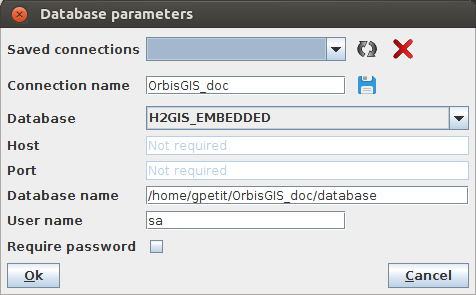
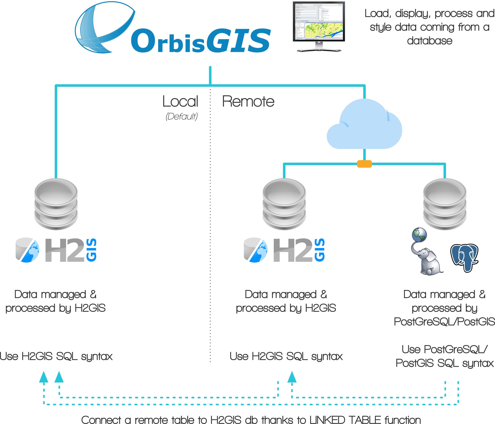
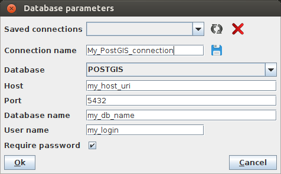
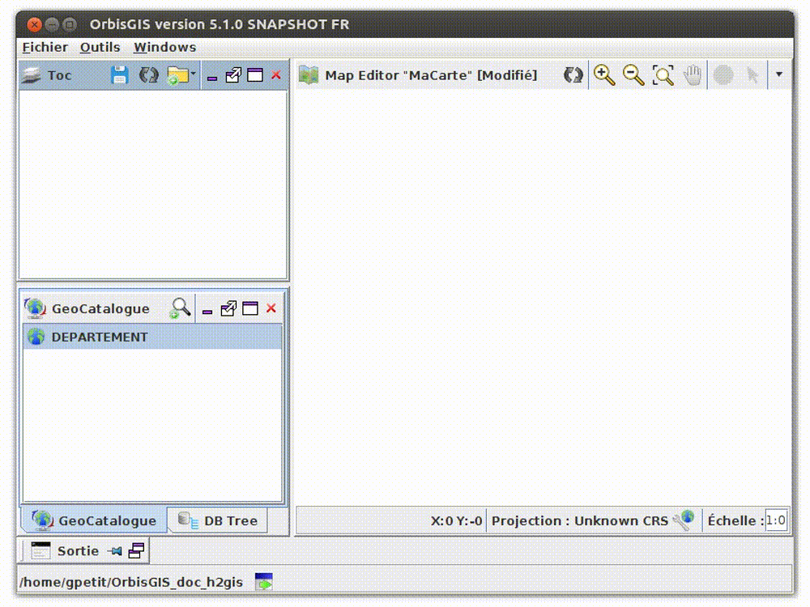
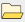
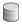

Quickstart 
==========

The workspace
-------------------

The workspace is the configuration of all your parameters and your User Interface *(UI)*. You can create as many workspaces you want and switch them in a very quick way using `the workspace manager`_ .

The following items are saved in the workspace:

* Opened windows (with their size and place in the UI) (see :ref:`main_components`),
* `Database`_ connection parameters,
* Map context file (loaded layers in the :ref:`toc`),
* Toolbox parameters.

The workspace manager 
***********************

When you launch OrbisGIS, the first panel displayed is the "Workspace Manager". This interface, allows the user to create and choose workspaces.

.. image:: ../_images/wksp_manager.png
              :alt: Workspace manager
              :align: center

* To create a new workspace, just click on  |AddWksp| . In the new panel, create a new empty folder where you want, select it and press "OK".
* You can select already created workspaces using the drop down list.
* If you check the "Set as default?" box, you will skip the Workspace Manager the next time you will launch OrbisGIS (not an irreversible action).
* If you want to configure your database, click on |WkspCustomDB|  (*Customize your database*) (see `Database`_).
* If you **don't** want to configure your database, just press "OK". In this case, a default H2GIS db (named "database.mv.db") will automaticaly be created in your workspace folder. The default login of this db is "sa" and there is no password.

Database
---------------

OrbisGIS is build on top of a relational spatial database. All data are managed and queried from a JDBC driver.
By default OrbisGIS starts with the embedded spatial database H2GIS_. However, OrbisGIS could also be connected to a PostgresSQL_/PostGIS_ database.

What does it mean ?
*******************

It mean that all the data you are using are interpreted as tables in OrbisGIS and can be processed thanks to the Spatial SQL langage. It also mean that if you choose to connect OrbisGIS to an existing PostGIS db, you will be able (1) to display and process your data, (2) to execute your PostGreSQL/PostGIS scripts directly into OrbisGIS, without any changes and (3) to use specific PostGreSQL/PostGIS functions.

Configure
**********

To configure your database connection, click on  |WkspCustomDB|  (*Customize your database*). The following panel will appear.

Here you have:

* Saved connections: list of already existing connections,
* Connection name: the name of your connection (shortcut for all you parameters),
* Database: select the type of db you want to connect *(see below)*, 
* Host: only if the choosen db is not "H2GIS_EMBEDDED",
* Port: *idem*,
* Database name: if "H2GIS_EMBEDDED", URI of the local .db file.  Else, the name of the remote db,
* User name: default value is "sa",
* Require password: check if you want to specify a password to connect to your db.

Database type: 

* H2GIS_EMBEDDED: installed and deployed locally. By default the H2GIS db is stored in the workspace folder. This db may have been created by OrbisGIS, or by H2GIS_,
* H2GIS_SERVER: remote H2GIS db,
* POSTGIS: remote PostGIS db.

The figure below summarizes this philosophy:

Example with a PostGIS db
*************************

Once you open OrbisGIS with this db connection, you should see all your existing tables displayed in the :ref:`geocatalog`.

Load data
-------------

To load data, just make a right-click in the :ref:`geocatalog` and choose "Add" or "Import".

* Add: Link a new database table to a file (vector, alphanumeric, ...),
	* Pro:
		* Immediate table creation,
		* Does not take more disk space,
		* Can create spatial index.
	* Cons:
		* Read-only table,
		* Cannot create alpha-numeric index,
		* Only compatible with h2 database.
* Import: Copy the file content into a new database table,
	* Pro:
		* Create a native h2/PostGIS table,
		* Read/Write table,
		* Can create spatial index and alpha-numeric index.
	* Cons:
		* Take time to create the table depending on file size,
		* Take more disk space.

For both options, you can choose:

* File: point one or many (using Ctrl + Click) files in a same folder,
* Folder: after selecting the type of file, point a folder. Here, selected type of file will be searched into the folder and potential sub-folders (*e.g.* open all .shp files present in the folder "GIS_Data")

Formats
********

Below is the list of **readable** formats that you can choose in the UI, depending if you chose "Add" or "Import".

+--------+-----+-----+-----+---------+-----+-----+-----+
| Format | SHP | GPX | OSM | GeoJSON | CSV | DBF | TSV | 
+========+=====+=====+=====+=========+=====+=====+=====+
| Add    | YES |  NO |  NO |  NO     |  NO | YES |  NO | 
+--------+-----+-----+-----+---------+-----+-----+-----+
| Import | YES | YES | YES |  YES    | YES | YES | YES | 
+--------+-----+-----+-----+---------+-----+-----+-----+

Remarks:

* You can find a full description of readable and writable formats here : http://www.h2gis.org/docs/dev/h2drivers/
* Because OrbisGIS uses a RDBMS, a data is represented as a table and could be requested using the SQL languague.

Display on the map
-------------------------

To display a geographic layer (vector or raster), just drag & drop it from the  :ref:`geocatalog` to the :ref:`toc`.

Display attributes
-----------------------

To see how to display attributes, have a look at :ref:`show_attributes` page.

..........................................................................................................
.. List of links

.. _H2GIS: http://www.h2gis.org/
.. _PostgresSQL: https://www.postgresql.org/
.. _PostGIS: http://www.postgis.net/

..........................................................................................................
.. List of images

