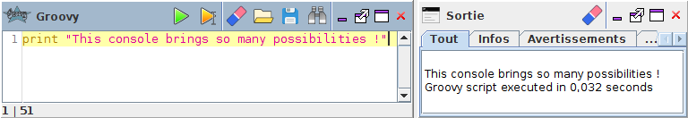

.. Author : Gwendall PETIT (Lab-STICC - CNRS UMR 6285 / DECIDE Team)

.. _groovy_console:

Scripting with Groovy
==========================

Thanks to its official "Groovy Console" plugin, OrbisGIS is able to execute instructions written in Groovy_ programming language.

To see how to install this plugin, you are invited to consult `this page`_ or just check for "Groovy console" in the :ref:`pluginsManager`.

.. _this page: https://github.com/orbisgis/orbisgis-official-plugins/tree/master/groovyConsole
.. _Groovy: http://groovy-lang.org/

Here, the user is able to:

* Write & execute ( |Execute| ) instructions,
* Execute only selected instructions ( |ExecuteSelect| ),
* Load & Save .groovy files,
* Search & Replace words *(with advanced options)* ( |Search| ),

.................................................................................................................

.. |Execute| image:: ../_images/execute.png
              :alt: Execute SQL instruction icon
	      :width: 16 pt

.. |Search| image:: ../_images/find.png
              :alt: Search icon
	      :width: 16 pt

Use cases
-----------------

Include SQL into Groovy script
***********************************************

Below is an example of how to use SQL instructions into Groovy script. Here we just want to retrieve the coordinates of a point, which is stored in a layer called "TEST".

.. code-block:: groovy
       :linenos:
   
	import groovy.sql.Sql;

	// Execute SQL request
	sql.execute("DROP TABLE IF EXISTS TEST")
	sql.execute("CREATE TABLE TEST AS SELECT 'POINT(1 3 10)'::geometry THE_GEOM")

	// Fetch results and print point coordinates
	// row["THE_GEOM"] is an instance of 
	// http://tsusiatsoftware.net/jts/javadoc/com/vividsolutions/jts/geom/Point.html
	sql.eachRow("SELECT * FROM TEST") { row ->
	    pt = row["THE_GEOM"].getCoordinate()
	    print(pt.x+" "+pt.y+" "+pt.z)
	}

The result is displayed in the Output Console:

.. code-block:: bash

	1.0 3.0 10.0

To see more about Groovy, you can consult this tutorial_ from the official Groovy documentation.

.. _tutorial: http://docs.groovy-lang.org/latest/html/documentation/#_interacting_with_a_sql_database
