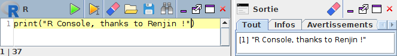
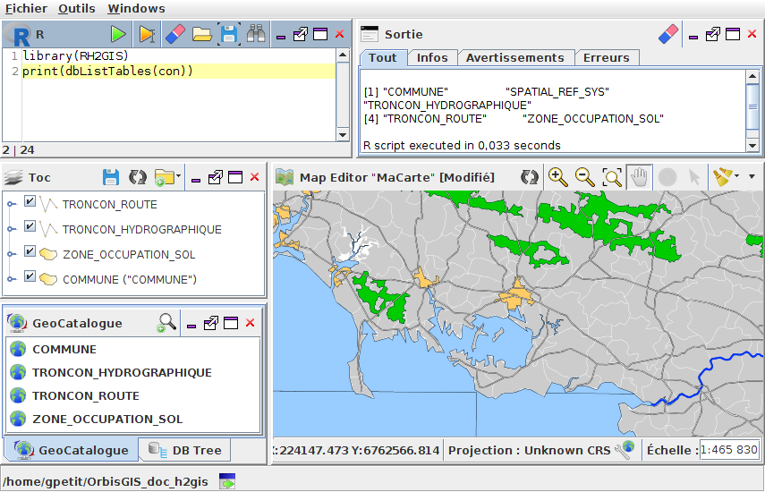

.. Author : Gwendall PETIT (Lab-STICC - CNRS UMR 6285 / DECIDE Team)

.. _r_console:

Scripting with R
==========================

Thanks to its official "R Console" plugin, OrbisGIS is able to execute instructions written in R_ language.

To see how to install this plugin, you are invited to consult `this page`_ or just check for "R console" in the :ref:`pluginsManager`.

The "R console" is based on Renjin_. Renjin is a JVM-based interpreter for the R language for statistical computing.

.. _Renjin: http://www.renjin.org/

.. _this page: https://github.com/orbisgis/orbisgis-official-plugins/tree/master/r-console
.. _R: https://www.r-project.org/

Here, the user is able to:

* Write & execute ( |Execute| ) instructions,
* Execute only selected instructions ( |ExecuteSelect| ),
* Load & Save .r files,
* Search & Replace words *(with advanced options)* ( |Search| ),

.................................................................................................................

.. |Execute| image:: ../_images/execute.png
              :alt: Execute SQL instruction icon
	      :width: 16 pt

.. |ExecuteSelect| image:: ../_images/execute_selection.png
              :alt: Execute Selected SQL instruction icon
                            :width: 16 pt             

.. |Search| image:: ../_images/find.png
              :alt: Search icon
	      :width: 16 pt

Use cases
-----------------

List tables stored in the default H2GIS database
**************************************************************

In this example, we are using R to list available tables imported in OrbisGIS *(assuming you are in H2GIS mode)*.

.. code-block:: r
       :linenos:
   
	library(RH2GIS)
	print(dbListTables(con))

The result is displayed in the Output Console:

.. code-block:: bash

	[1] "COMMUNE"                "SPATIAL_REF_SYS"        "TRONCON_HYDROGRAPHIQUE"
	[4] "TRONCON_ROUTE"          "ZONE_OCCUPATION_SOL"   

