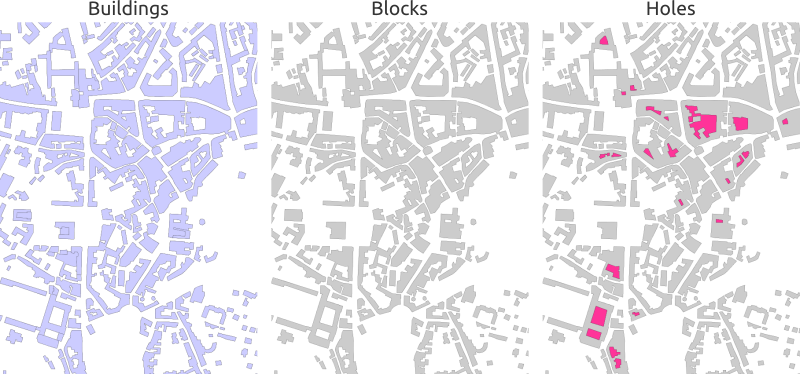
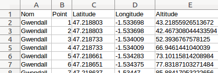
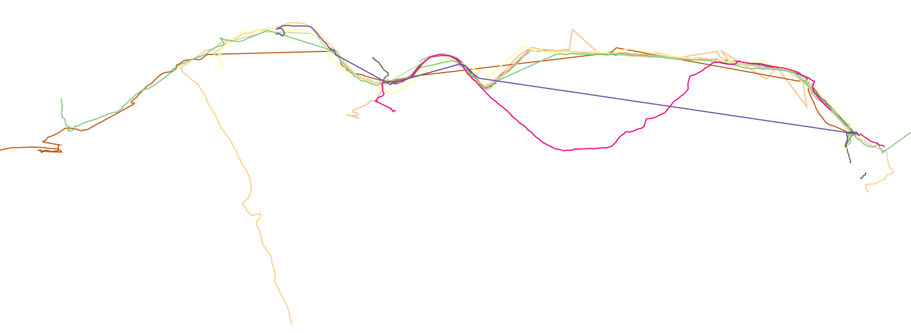

.. Author : Gwendall PETIT (Lab-STICC - CNRS UMR 6285 / DECIDE Team)

.. _script_sql:

Scripting with SQL
==========================

SQL language
-----------------------

In OrbisGIS, you can process data using the Spatial SQL langage. To do so, you have to execute your instructions into the `SQL Console`_.

Here, all Spatial SQL functions and operators are based on the `H2GIS`_ RDBMS* and are mostly following the OGC `Simple Feature Access - SQL`_ standard.
 

\* Remarks:

* *Only if you started OrbisGIS in H2GIS (local or remote) mode* (see :ref:`configure`).
* *In this configuration, the "non-spatial" SQL functions and operators are executed by the* `H2 Database Engine`_. *Consult its quite complete documentation if you have any question about SQL.*

.. _H2GIS: http://www.h2gis.org
.. _Simple Feature Access - SQL: http://www.opengeospatial.org/standards/sfs
.. _see more: http://www.opengeospatial.org/standards/sfs
.. _H2 Database Engine: http://h2database.com/html/main.html

.. _sql_console:

SQL Console
-----------------------

The SQL console ( |SQLCode| ) is the place where the user can execute SQL scripts. This component is available through the "Tools" menu. 

Note that:

* You can open as many Console you want,
* The content of your Console can be automaticaly saved when you close OrbisGIS.

.. image:: ../_images/sql_console.png
              :alt: SQL Console UI
              :align: center

Here, the user is able to:

* Write & execute ( |SQLExecute| ) instructions,
* Execute only selected instructions ( |SQLExecuteSelect| ),
* Load & Save .sql files,
* Search (spatial) SQL functions and operators into a predetermined list ( |SQLfunctions| ) (the full list is available here_),
* To drag & drop a function from the list to the text area, in order to see the default syntax of the chosen function,
* Search & Replace words *(with advanced options)* ( |Search| ),
* Share SQL instructions via email (need the "`Mailto`_" plugin),
* To auto-complete instructions *(see* `Auto-completion`_ *)*.

.. _here: http://www.h2gis.org/docs/dev/functions/
.. _Mailto: https://github.com/orbisgis/orbisgis-official-plugins/tree/master/mailto

Remarks:

* You are able to open as many console you want,
* The content of the console is saved by default,
* There is syntax coloration that helps the user to read the instructions,
* You also have some additional functionalities thanks to a right-click in the text area.

Below are some other tooltips:

.. code-block:: sql
       :linenos:
   
       SELECT * FROM CITIES;

       -- double dash to write a comment

       /* 
       or use / and * to write
       a comment on many lines
       */

       SELECT * FROM CITIES WHERE NAME='Perugia';

       -- Automatic completion using the shortcut Ctrl + Space

       -- Execute the script using the shortcut Ctrl + Enter
       

Auto-completion
***************************

To use the auto-completion, just press "Ctrl + Space". For example, if you write “sel” and then press “Ctrl + Space”, OrbisGIS will recognize that you want to write “SELECT”. In the same spirit, if you start writing the name of a function, a table or field, a dropdown list will appear on the right to offer you the corresponding elements.

Below is an illustration video *(made for the V3.0 but works in the same spirit in the last version of OrbisGIS)*.

.. raw:: html

        <iframe width="560" height="315" src="https://www.youtube.com/embed/neFpyo2qaAI" frameborder="0" allowfullscreen></iframe>

.................................................................................................................

.. |SQLCode| image:: ../_images/sql_code.png
              :alt: SQL Console icon
	      :width: 16 pt

.. |SQLExecute| image:: ../_images/execute.png
              :alt: Execute SQL instruction icon
	      :width: 16 pt

.. |SQLExecuteSelect| image:: ../_images/execute_selection.png
              :alt: Execute Selected SQL instruction icon
                            :width: 16 pt             

.. |SQLfunctions| image:: ../_images/builtinfunctionmap.png
              :alt: SQL functions icon
	      :width: 16 pt

.. |Search| image:: ../_images/find.png
              :alt: Search icon
	      :width: 16 pt

Use cases
-----------------------

Below are some use cases to illustate the power of Spatial SQL in OrbisGIS.

Detect holes into geometries
*******************************************************

Here, we want to detect interior holes in a group of buildings (called *block*).

Method :
	1. Merge buildings
	2. Explode multi-geometries
	3. Produce holes and keep only polygon information

SQL instructions:

.. code-block:: sql
       :linenos:

	DROP TABLE IF EXISTS BLOCK , BLOCK_EXPL, HOLES, BLOCK_HOLES ;
	-- All buildings are merge into one, if there are 1cm far from the others
	CREATE TABLE BLOCK AS 
		SELECT ST_UNION(ST_ACCUM(ST_BUFFER(THE_GEOM ,0.01))) as THE_GEOM 
		FROM BUILDINGS;

	-- We explode this table in order to convert multipolygons into simple polygons
	CREATE TABLE BLOCK_EXPL AS SELECT * FROM ST_EXPLODE ('BLOCK') ;

	-- We remove the table BLOCK and we rename BLOCK_EXPL to be more clear
	DROP TABLE BLOCK;
	ALTER TABLE BLOCK_EXPL RENAME TO BLOCK ;
	-- We add the "PK_BLOCK" id, which will be a primary key
	ALTER TABLE BLOCK ADD COLUMN PK_BLOCK serial ;
	CREATE PRIMARY KEY ON BLOCK(PK_BLOCK);
	CREATE SPATIAL INDEX ON BLOCK(THE_GEOM);

	-- We creates holes and we keep only surfacic geometries (dimension = 2)
	DROP TABLE IF EXISTS HOLES, BLOCK_HOLES ;
	CREATE TABLE HOLES AS SELECT ST_HOLES(THE_GEOM) as THE_GEOM, PK_BLOCK FROM BLOCK;
	CREATE TABLE BLOCK_HOLES AS SELECT * FROM HOLES WHERE ST_DIMENSION(THE_GEOM)=2;

Result:

Spatialize GPS data
************************************

From a .csv file *(see screenshot below)*, that contains GPS tracks of different peoples, recreate tracks and visualize the result in a map.

SQL instructions:

.. code-block:: sql
       :linenos:

	-- 1. Import .csv file into a table called MY_GPS_POINTS
	DROP TABLE IF EXISTS MY_GPS_POINTS;
	CREATE TABLE MY_GPS_POINTS AS SELECT * 
		FROM CSVRead('/my_url/gps_tracks.csv');

	-- 2. Convert this table into a point layer (keeping all possible attributes)
	DROP TABLE IF EXISTS MY_POINTS;
	CREATE TABLE MY_POINTS AS 
		SELECT ST_MAKEPOINT(LONGITUDE,LATITUDE) as THE_GEOM, NAME, POINT, ALTITUDE 
		FROM MY_GPS_POINTS;

	-- 3. Update Z value of points, using the Altitude field
	UPDATE MY_POINTS SET THE_GEOM=ST_UPDATEZ(THE_GEOM, ALTITUDE);

	-- 4. Generate a new layer with the different tracks stored as lines (one per people)
	DROP TABLE IF EXISTS LINES;
	CREATE TABLE LINES AS SELECT ST_MAKELINE(ST_ACCUM(THE_GEOM)) as THE_GEOM, NAME 
		FROM MY_POINTS GROUP BY NAME;

Result:

