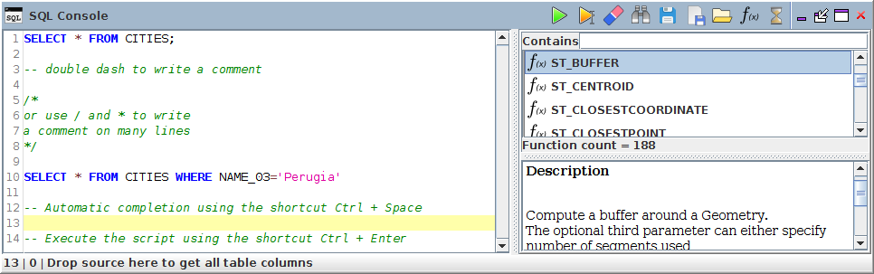

.. _sql_console:

SQL Console
===========

The SQL console ( |SQLCode| ) is the place where the user can execute SQL scripts. This component is available through the "Tools" menu.

Here, the user is able to:

* Write & execute ( |SQLExecute| ) instructions,
* Execute only selected instructions ( |SQLExecuteSelect| ),
* Load & Save .sql files,
* Search (spatial) SQL functions and operators into a predetermined list ( |SQLfunctions| ) (the full list is available here_),
* To drag & drop a function from the list to the text area, in order to see the default syntax of the chosen function,
* Search & Replace words *(with advanced options)* ( |Search| ),
* Share SQL instructions via email *(need a specific plugin)*,
* To auto-complete instructions *(see* `Auto-completion`_ *)*.

.. _here: http://www.h2gis.org/docs/dev/functions/ 

Remarks:

* You are able to open as many console you want,
* The content of the console is saved by default,
* There is syntax coloration that helps the user to read the instructions,
* You also have some additional functionalities thanks to a right-click in the text area.

Below are some other tooltips:

.. code-block:: sql
       :linenos:
   
       SELECT * FROM CITIES

       -- double dash to write a comment

       /* 
       or use / and * to write
       a comment on many lines
       */

       SELECT * FROM CITIES WHERE NAME='Perugia'

       -- Automatic completion using the shortcut Ctrl + Space

       -- Execute the script using the shortcut Ctrl + Enter
       

Auto-completion
----------------------

To use the auto-completion, just press "Ctrl + Space". For example, if you write “sel” and then press “Ctrl + Space”, OrbisGIS will recognize that you want to write “SELECT”. In the same spirit, if you start writing the name of a function, a table or field, a dropdown list will appear on the right to offer you the corresponding elements.

Below is an illustration video *(made for the V3.0 but works in the same spirit in the last version of OrbisGIS)*.

.. raw:: html

        <iframe width="560" height="315" src="https://www.youtube.com/embed/neFpyo2qaAI" frameborder="0" allowfullscreen></iframe>

.................................................................................................................

.. |SQLCode| image:: ../_images/sql_code.png
              :alt: SQL Console icon
	      :width: 16 pt

.. |SQLExecute| image:: ../_images/execute.png
              :alt: Execute SQL instruction icon
	      :width: 16 pt

.. |SQLExecuteSelect| image:: ../_images/execute_selection.png
              :alt: Execute Selected SQL instruction icon
                            :width: 16 pt             

.. |SQLfunctions| image:: ../_images/builtinfunctionmap.png
              :alt: SQL functions icon
	      :width: 16 pt

.. |Search| image:: ../_images/find.png
              :alt: Search icon
	      :width: 16 pt

